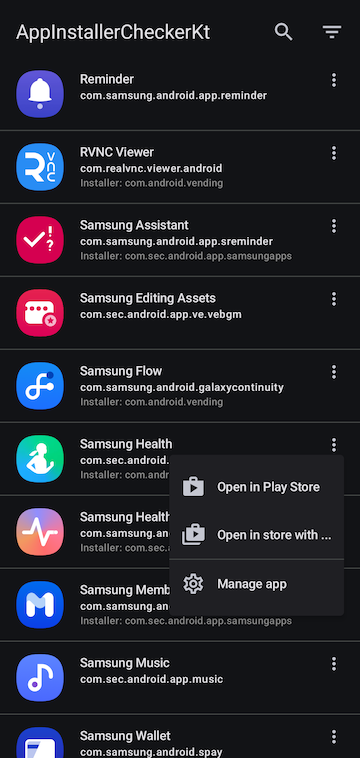

# AppInstallerCheckerKt

An app to quickly check the install source of apps.

This app allows you to easily check the installation source of apps on your device.
It's particularly useful for identifying apps not install from the Play Store and relinking them to the Play Store for updates (by manually update them from Play Store once).

Additionally, this is a practice project for me learning [Material Design 3](https://m3.material.io/), [Jetpack compose](https://developer.android.com/compose), [Kotlin flows](https://developer.android.com/kotlin/flow), [Hilt](https://developer.android.com/training/dependency-injection/hilt-android).

## Features

* List apps from your device
* Filtering apps based on their install source (Play Store or other sources)
* Search and sort apps
* Click on an app to open it directly in the Play Store
